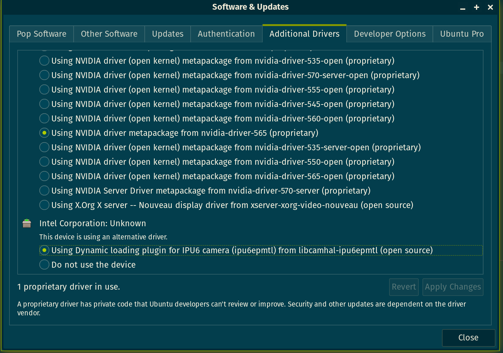

My old XPS15 9500 went up in smoke (literally) after five years of service, so I acquired a new XPS16 9640 for work. Unfortunately, there are known webcam [^1] and sound driver [^2] issues with the XPS16 9640, that for whatever reason has not been fixed. Most of the fixes online are for Ubuntu 24.04 and 24.10, but there are no simple solutions for getting the device to work for Pop!\_OS 22.04, kernel >=6.10 and Meteor Lake. This guide is a collection of temporary fixes until the issue is resolved in the mainline kernel.

## Fixing Sound
On a fresh install, the sound output shows "Dummy Output" as the audio output. This is because the `sof` driver is not installed. To fix this, download and install the `sof` driver
```bash
mkdir sof-install
cd sof-install
wget https://github.com/thesofproject/sof-bin/releases/download/v2025.01/sof-bin-2025.01.tar.gz
tar -xvf sof-bin-2025.01.tar.gz
cd sof-bin-2025.01
```

Then remove the existing firmware and install the new one
```bash
sudo rm -rf /lib/firmware/intel/sof-\*  
sudo ./install.sh
sudo reboot
```

After rebooting the device, the sound card is now detected
```bash
(base) txia23@pop-os:~$ aplay -l
**** List of PLAYBACK Hardware Devices ****
card 0: sofsoundwire [sof-soundwire], device 0: Jack Out (*) []
  Subdevices: 0/1
  Subdevice #0: subdevice #0
card 0: sofsoundwire [sof-soundwire], device 2: Speaker (*) []
  Subdevices: 1/1
  Subdevice #0: subdevice #0
card 0: sofsoundwire [sof-soundwire], device 5: HDMI1 (*) []
  Subdevices: 1/1
  Subdevice #0: subdevice #0
card 0: sofsoundwire [sof-soundwire], device 6: HDMI2 (*) []
  Subdevices: 1/1
  Subdevice #0: subdevice #0
card 0: sofsoundwire [sof-soundwire], device 7: HDMI3 (*) []
  Subdevices: 1/1
  Subdevice #0: subdevice #0
card 0: sofsoundwire [sof-soundwire], device 31: Deepbuffer Jack Out (*) []
  Subdevices: 1/1
  Subdevice #0: subdevice #0
```
but there is no sound output. Running `pactl` shows only one output profile
```bash
(base) txia23@pop-os:~$ pactl list short sources
366	alsa_output.pci-0000_00_1f.3-platform-sof_sdw.stereo-fallback.monitor	PipeWire	s32le 2ch 48000Hz	IDLE
```

Now redirect the sound output to `output2`. First run `pavucontrol`, find the configuration tab and select `Pro Audio` as the output profile under `sof-soundwire`. Then run
```bash
pactl set-default-sink alsa_output.pci-0000_00_1f.3-platform-sof_sdw.pro-output-2
``` 
This will set the default output to `output2` and the sound will now be outputted to the speakers. At any point, one can run
```bash
speaker-test -Dhw:0,2 -c2
```
to play some pink noise to test the output.


## Fixing Webcam

This problem is slightly nastier. The crux of the issue is that the `intel-ipu6`  driver is not installed, and also the video feed is not directed to the correct video sink. First add the OEM Solutions PPA [^3] to the system

```bash
sudo add-apt-repository ppa:oem-solutions-group/intel-ipu6
sudo apt update
```
Then identify the kernel version
```bash
uname -r
```
My kernel version is `6.12.10-76061203-generic` so there are no `intel-ipu6` packages for this kernel version. A workaround is to install the generic kernel patch
```bash
sudo apt install linux-modules-ipu6-generic-hwe-22.04 linux-modules-ivsc-generic-hwe-22.04
```
Then install all the required packages

```bash
sudo apt install libcamhal0 libcamhal-ipu6ep0 libipu6ep v4l2loopback-dkms v4l2-relayd v4l-utils gstreamer1.0-icamera
```
Enable the driver in `Additional Drivers`. This is by default not installed in Pop!\_OS 22.04, but it comes with `gnome-software`
```bash
sudo apt install gnome-software
```
Run `Additional Drivers` and enable the `Intel IPU6` driver



Reboot
```bash
sudo reboot
```
At this point, the webcam is detected
```bash
(base) txia23@pop-os:~$ v4l2-ctl --list-devices
ipu6 (PCI:0000:00:05.0):
    /dev/media0

Intel MIPI Camera (platform:v4l2loopback-000):
    /dev/video0
```
The virtual loopback device is created at `/dev/video0`
```bash
(base) txia23@pop-os:~$ v4l2-ctl --device=/dev/video0 --all
Driver Info:
    Driver name      : v4l2 loopback
    Card type        : Intel MIPI Camera
    Bus info         : platform:v4l2loopback-000
    Driver version   : 6.12.10
    Capabilities     : 0x85200001
        Video Capture
        Read/Write
        Streaming
        Extended Pix Format
        Device Capabilities
    Device Caps      : 0x05200001
        Video Capture
        Read/Write
        Streaming
        Extended Pix Format
Priority: 2
Video input : 0 (loopback: ok)
Format Video Capture:
    Width/Height      : 1280/720
    Pixel Format      : 'NV12' (Y/UV 4:2:0)
    Field             : None
    Bytes per Line    : 1280
    Size Image        : 1382400
    Colorspace        : Rec. 709
    Transfer Function : sRGB
    YCbCr/HSV Encoding: ITU-R 601
    Quantization      : Limited Range
    Flags             : 
Format Video Output:
    Width/Height      : 1280/720
    Pixel Format      : 'NV12' (Y/UV 4:2:0)
    Field             : None
    Bytes per Line    : 1280
    Size Image        : 1382400
    Colorspace        : Rec. 709
    Transfer Function : sRGB
    YCbCr/HSV Encoding: ITU-R 601
    Quantization      : Limited Range
    Flags             : 
Streaming Parameters Video Capture:
    Frames per second: 30.000 (30/1)
    Read buffers     : 2
Streaming Parameters Video Output:
    Frames per second: 30.000 (30/1)
    Write buffers    : 2

User Controls

                    keep_format 0x0098f900 (bool)   : default=0 value=0
              sustain_framerate 0x0098f901 (bool)   : default=0 value=0
                        timeout 0x0098f902 (int)    : min=0 max=100000 step=1 default=0 value=0
               timeout_image_io 0x0098f903 (button) : value=0 flags=write-only, execute-on-write
```
Running the following command outputs the webcam feed to the screen
```bash
sudo gst-launch-1.0 icamerasrc ! autovideosink
```
However, the feed is not sent correctly to the video sink. On sending the feed to `/dev/video0`, the feed is not displayed
```bash
(base) txia23@pop-os:~$ sudo gst-launch-1.0 -v icamerasrc ! v4l2sink device=/dev/video0 
[03-24 22:40:44.801] CamHAL[ERR] Malformed ET range in exposure time range configuration
[03-24 22:40:44.801] CamHAL[ERR] Parse AE eExposure time range failed
Setting pipeline to PAUSED ...
[03-24 22:40:44.887] CamHAL[INF] aiqb file name OV02C10_1BG203N3_ADL.aiqb
[03-24 22:40:44.887] CamHAL[INF] aiqb file name OV02C10_1BG203N3_ADL.aiqb
[03-24 22:40:44.888] CamHAL[INF] aiqb file name OV02C10_1SG204N3_ADL.aiqb
[03-24 22:40:44.888] CamHAL[INF] aiqb file name OV02C10_1SG204N3_ADL.aiqb
[03-24 22:40:44.888] CamHAL[INF] aiqb file name OV02C10_CIFME14_ADL.aiqb
[03-24 22:40:44.888] CamHAL[INF] aiqb file name OV02C10_CIFME14_ADL.aiqb
[03-24 22:40:44.888] CamHAL[INF] aiqb file name AR0234_TGL_10bits.aiqb
[03-24 22:40:44.888] CamHAL[INF] aiqb file name AR0234_TGL_10bits.aiqb
[03-24 22:40:44.888] CamHAL[INF] aiqb file name AR0234_TGL_10bits.aiqb
[03-24 22:40:44.888] CamHAL[INF] aiqb file name AR0234_TGL_10bits.aiqb
[03-24 22:40:44.888] CamHAL[INF] aiqb file name AR0234_TGL_10bits.aiqb
[03-24 22:40:44.888] CamHAL[INF] aiqb file name AR0234_TGL_10bits.aiqb
[03-24 22:40:44.889] CamHAL[INF] aiqb file name AR0234_TGL_10bits.aiqb
[03-24 22:40:44.889] CamHAL[INF] aiqb file name AR0234_TGL_10bits.aiqb
Pipeline is live and does not need PREROLL ...
Pipeline is PREROLLED ...
Setting pipeline to PLAYING ...
New clock: GstSystemClock
ERROR: from element /GstPipeline:pipeline0/Gstcamerasrc:camerasrc0: src pad: Internal data flow error.
Additional debug info:
gstcambasesrc.cpp(3156): gst_cam_base_src_loop (): /GstPipeline:pipeline0/Gstcamerasrc:camerasrc0:
streaming task paused, reason not-negotiated (-4)
Execution ended after 0:00:00.000625614
Setting pipeline to NULL ...
Freeing pipeline ..
```
This can be fixed by correcting the modprobe config file for the `v4l2loopback` virtual camera
```bash
sudo nano /etc/modprobe.d/v4l2-relayd.conf
```
Add the following line to the file
```
options v4l2loopback exclusive_caps=1 video_nr=0 card_label="Intel MIPI Camera"
```
Also update the `v4l2-relayd` config file to point to `icamerasrc`
```bash
sudo nano /etc/v4l2-relayd.conf
```
Add the following line to the file
```
VIDEOSRC=icamerasrc
FORMAT=NV12
WIDTH=1280
HEIGHT=720
FRAMERATE=30/1
CARD_LABEL="Intel MIPI Camera"
```
Now run the following command again to check that the feed is being sent to the correct video sink
```bash
sudo gst-launch-1.0 icamerasrc ! v4l2sink device=/dev/video0
```
Open `VLC>Media>Open Capture Device` and select `Intel MIPI Camera.` The feed is alive!


[^1]: https://bugs.launchpad.net/ubuntu/+source/firmware-sof/+bug/2058691
[^2]: https://github.com/intel/ipu6-drivers/issues/223
[^3]: https://launchpad.net/~oem-solutions-group/+archive/ubuntu/intel-ipu6

